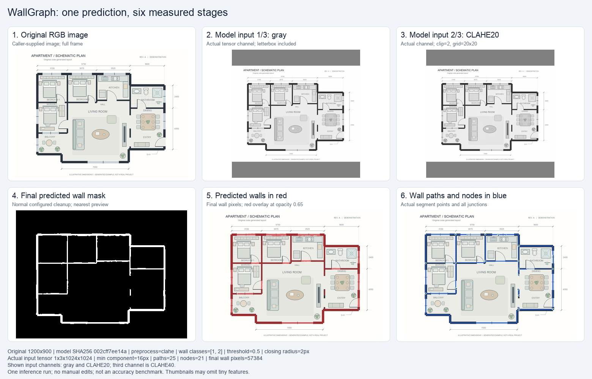

# WallGraph

把墙体分割掩码变成**原图坐标下的中心线、交点和闭环**。

[English](README.md) · [发布版本](https://github.com/crown-sports/wallgraph/releases)



同一张生成户型图、一次私有 ONNX 模型推理：原图 → 实际灰度通道 → 实际 CLAHE20 通道 → 最终墙体掩码 → 红色墙体叠加 → 蓝色中心线与节点。**25 条路径、21 个节点**，没有手工修图。模型第三通道 CLAHE40 未展示。这次预测把部分门洞、窗线连成了墙，客厅短隔墙仍有断线。[图像来源与参数](docs/demo-provenance.md)。

## 安装与运行

需要 Python 3.10 或更新版本。另有无需模型的简单 demo：

```bash
python -m pip install "git+https://github.com/crown-sports/wallgraph.git@v0.1.2"
wallgraph demo --output runs/demo
```

打开 `runs/demo/walls.svg` 查看结果。

| 输出 | 能拿来做什么 |
| --- | --- |
| `walls.svg` | 查看提取的墙体路径 |
| `walls.json` | 绘制墙线、按端点查连接关系、读取像素厚度和置信度 |
| `walls.png` | 保留二值掩码，或传入区域分析 |

坐标对应原图：左上角为原点，x 向右、y 向下，单位为像素。闭合墙环保留锚点节点。工具不推算真实比例尺。

## 接入自己的墙体模型

```bash
python -m pip install "wallgraph[onnx] @ git+https://github.com/crown-sports/wallgraph.git@v0.1.2"
wallgraph detect --image /private/plan.png --model /private/wall.onnx \
  --preprocess rgb --wall-classes 1 --device cpu --output runs/prediction
```

ONNX 接口接受 float32 NCHW 三通道输入，范围为 0–1，输出为二分类或多分类分割 logits。预处理和墙体类别需与自己的模型一致；概率输出加 `--output-kind probabilities`，动态空间尺寸加 `--input-size H W`。

在 main 分支的源码目录中，可用自己的兼容模型重新生成上述六步图：

```bash
python tools/render_demo.py --model /private/wall.onnx --preprocess clahe \
  --wall-classes 1 2 --output /private/steps.png
```

**真实识别需自备兼容模型。** 仓库不提供权重或真实数据集。CLI 的简单 demo 使用墨迹阈值，会把文字和家具也当成墙；六步图使用实际 ONNX 分割模型。两者都不是准确率评测。

## 具体解决哪些问题

| 你手上有什么 | 接下来要做什么 | WallGraph 提供什么 |
| --- | --- | --- |
| 由粗像素组成的墙体掩码 | 在图纸界面叠加或选中一条墙线 | 中心线折线与端点节点 ID |
| 按模型尺寸缩放过的预测 | 将几何结果对齐原始图纸 | 恢复到原图坐标的掩码与路径 |
| 不同的分割模型 | 复用同一套几何处理接口 | 可替换的 ONNX 或 Python 推理后端 |
| 用于房间提取的墙体预测 | 给区域算法传入对齐的边界 | [PlanRegions](https://github.com/crown-sports/planregions) 可读取的掩码与元信息 |

家具、文字和细墙都可能造成错漏。保留掩码与几何结果，方便先检查模型认出了什么，再把坐标用于图纸界面或区域分析。复核编辑器、CAD/BIM 导出、门的语义和尺寸识别仍需应用层实现。接入方式见[使用场景](docs/use-cases.zh-CN.md)。

## 实测与限制

使用同一个私有模型，在 30 张标注图纸上，验证集选定配置的墙体 macro IoU 为 **0.84203**，旧工程最终掩码为 **0.78478**，原始分割为 **0.86334**。墙体召回下降，下游区域 PQ 也从 **0.68034 降至 0.56580**。仓库训练基线的 IoU 为 **0.59297**，一次导出检查超出了选定的数值误差阈值。结果支持继续改进，不能作为生产精度保证。[完整实验、区间和耗时](docs/validation.md)。

像素分数高，房间边界也可能出问题。[生成的交互示例](https://crown-sports.github.io/planregions/)展示了少一个墙像素时，两个区域怎样合并。

## 文档

[训练与数据导入](docs/training-guide.zh-CN.md) · [方法与论文](docs/methods.zh-CN.md) · [实现笔记](docs/reproduction.zh-CN.md) · [架构](docs/architecture.zh-CN.md) · [GPU 运行](docs/runtime.md)

[贡献指南](CONTRIBUTING.md) · [安全报告](SECURITY.md) · [行为准则](CODE_OF_CONDUCT.md) · [发布检查](docs/releasing.md)

仓库代码使用 MIT 许可；外部模型和数据保留各自许可。见[来源说明](NOTICE.md)。软件引用信息见 `CITATION.cff`。
