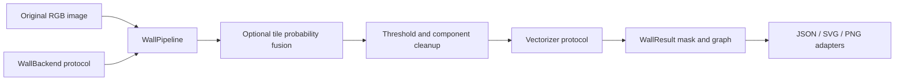

# Architecture

[中文](architecture.zh-CN.md)

`domain.py` defines outputs without depending on the CLI, ONNX Runtime, or PyTorch. `WallPipeline` is the application service. `WallBackend` and `Vectorizer` are strategy boundaries; concrete ONNX and image adapters implement them. The CLI composes dependencies instead of loading global models.

`OnnxBackend` creates one persistent session for an explicitly supplied model. Model routing belongs to the caller. CPU and CUDA are explicit choices; requested CUDA must fail rather than silently run model nodes on CPU. The package does not fetch weights or perform GPU initialization during import.

`WallConfig` is immutable and validates its values. Closing is disabled by default because it can remove real openings. Tiling blends probabilities and then applies one threshold. Coordinate restoration happens before geometry extraction; vector simplification does not alter the mask.

The graph tracer identifies endpoints and junction pixels, groups adjacent critical pixels into nodes, and traces each skeleton edge once. An all-degree-two connected component receives an anchor for its closed loop. Paths remain polylines rather than being forced to Manhattan directions. Thickness uses the pixel-center estimate `2*EDT-1`; junctions and diagonal walls have quantization error. Confidence is an uncalibrated mean probability along a path.

The output contract is `wallgraph/1`: original image coordinates, pixel units, positive wall mask polarity, explicit node references, configuration, and timing scope. Region consumers can validate that contract without importing the package internals.

An image with no walls returns an empty graph. Invalid images, configuration, incompatible model shapes, or nonfinite predictions raise errors. The I/O adapters accept local files; network services, authentication, OCR, physical-scale estimation, and region semantics belong to application code.
