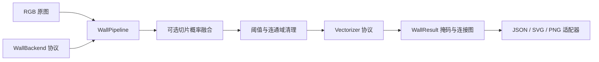

# 设计与职责边界

依赖方向从应用层指向协议与领域数据。`domain.py` 不依赖 CLI、ONNX Runtime 或训练框架。CLI 是组合入口，通过参数选择后端并注入流水线。`WallBackend` 是 Strategy / Adapter 的边界：墨迹基线和 ONNX 模型具有相同输出契约。`Vectorizer` 支持替换几何算法，流水线不依赖某个模型结构。

`OnnxBackend` 在实例化时建立一次推理会话，多次调用复用；没有进程级全局模型、隐式权重下载或导入时 GPU 初始化。CPU/CUDA 必须显式选择。CUDA 请求失败会报错，防止 CPU 跑出的时间被标成 GPU 结果。一个后端对应一个模型，模型路由可由调用方组合实现。

`WallConfig` 是不可变参数对象，在创建时检查数值。默认关闭形态学闭运算，以免自动抹掉真实门洞；如果需要连接漏检墙段，可以显式启用并做消融实验。所有图像运算保持原始坐标，矢量化只简化几何，不改变掩码。

骨架图中的关键像素包括端点和非二度交叉点，相邻关键像素聚合为一个节点；全二度连通分量视为闭环，添加一个锚点。每条骨架边只追踪一次。折线可弯折，不强制曼哈顿方向。厚度采样采用 `2*EDT-1` 的像素中心估计；连接处与斜墙仍有误差。置信度是路径骨架上的平均模型墙体概率，未经校准，也不表示整条墙正确的概率。

OCR、比例尺推断、设备推荐、云存储和区域语义不属于墙体领域。第二个区域工程读取墙体掩码，使用 `wallgraph/1` 元数据校验坐标约定，而不导入本工程内部实现。

错误契约：无墙图返回空图；空图像、无效配置、模型输入/输出不兼容、非有限概率直接报错。I/O 只接受本地文件，网络下载和身份认证由应用层处理。
